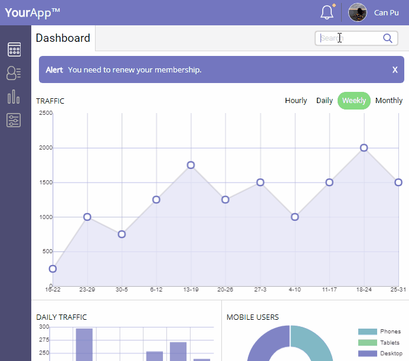

# treehouse-frontend-project07
TreeHouse FrontEnd Project 7 - WebApp Dashboard

[Click here](https://canpu.github.io/treehouse-frontend-project07) to view the demo.

## Brief Introduction

* This webpage is the dashboard of an imaginary app *YourApp*.
* The page layout is made by CSS grid.
* The user can view unread messages by clicking the bell with red dot; after dismissing all messages, the red dot will turn green.
* The user can view the statistics of traffic with selected scale (hourly, daily, weekly or monthly).
* The user can save his or her settings on local storage.
* The user searchbox has autocompleting feature.

## Techniques Involed

* HTML
* CSS
* Sass
* JavaScript
* jQuery
* Local storage

## External Plugins

* [chart.js](http://www.chartjs.org/)

